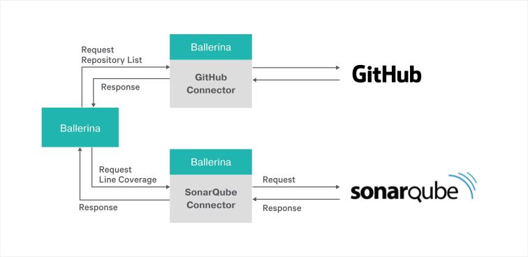

# SonarQube and GitHub Integration

SonarQube is an open source platform developed by SonarSource for continuous inspection of code quality to perform automatic reviews with static analysis of code to detect bugs, code smells and security vulnerabilities. Similarly GitHub brings together the world's largest community of developers to discover, share, and build better software. From open source projects to private team repositories, GitHub is an all-in-one platform for collaborative development.

> This guide walks you through the process of obtaining the test line coverage of each repository in a GitHub organization.

The following sections are covered in this guide.

- [What you'll build](#what-youll-build)
- [Prerequisites](#prerequisites)
- [Developing the program](#developing-the-program)
- [Testing](#testing)
- [Deployment](#deployment)
 
## What you'll build

Let's consider a sample scenario where a user requires test line coverage of all the repositories in the organization `wso2`. This guide specifies how Ballerina SonarQube and GitHub endpoints can be used to get a summary of the test line coverage of all repositories in the `wso2` organization.
 
In GitHub, there are numerous organizations that have a collection of repositories relevant to various projects, and Sonaqube contains the details regarding those projects; such as test line coverage, code duplications, and bugs. 

Therefore, you need obtain the list of repositories in `wso2` from GitHub and then send the repository list to Sonarqube to obtain the line coverage of each of the repositories.

The test line coverage of a repository is a significant metric that project leads require in order to get an overall understanding of the test coverage in the project.



In this example, we use the Ballerina GitHub endpoint to get a list of repositories under a specified organiztion in GitHub, and then pass that list to the Ballerina SonarQube endpoint to get the test line coverage of each repository.
 
## Prerequisites
- JDK 1.8 or later
- [Ballerina distribution](https://github.com/ballerina-platform/ballerina-lang/blob/master/docs/quick-tour.md)
- [Ballerina SonarQube](https://central.ballerina.io/packages/wso2/sonarqube6)
- [Ballerina GitHub](https://central.ballerina.io/packages/wso2/github4)
- A text editor or an IDE such as Intellij IDEA or Eclipse

**Optional requirements**
- Ballerina IDE plugins ([IntelliJ IDEA](https://plugins.jetbrains.com/plugin/9520-ballerina), 
[VSCode](https://marketplace.visualstudio.com/items?itemName=WSO2.Ballerina), 
[Atom](https://atom.io/packages/language-ballerina))
- [Docker](https://docs.docker.com/engine/installation/)


## Developing the program

### Before you begin
##### Understand the package structure
Ballerina is a complete programming language that can have any custom project structure that you wish. Although the language allows you to have any package structure, use the following package structure for this project to follow this guide.

```
line-coverage-with-sonarqube-github
├── RepositoryLineCoverageApp
│   ├── repository_line_coverage.bal
│   └── test
│       └── line_coverage_test.bal
├── README.md
├── Ballerina.toml
└── ballerina.conf

```

Package `RepositoryLineCoverageApp` contains the main Ballerina program that uses the Ballerina SonarQube and GitHub endpoints. These endpoints are used to fetch a list of repositories from a GitHub organization and then fetch the test line coverage of each of those repositories. It also contains a sub directory `test` that contains the tests that we write for the program.


### Implementation

In this section, this guide walks you through the steps in implementing the above mentioned Ballerina program.

The SonarQube and GitHub endpoints communicate with their respective APIs in order to obtain the data. Since these APIs are protected with authorization tokens, we need to configure both the SonarQube and GitHub endpoints by providing the respective access tokens.

> In this guide the access tokens are read from a configuration file. So, provide the SonarQube and GitHub access tokens in the 'ballerina.conf' file under the key names SONARQUBE_TOKEN and GITHUB_TOKEN. Since the Sonarqube endpoint is dynamic, we need to specify it under the key name SONARQUBE_ENDPOINT.

```
GITHUB_TOKEN=""
SONARQUBE_TOKEN=""
SONARQUBE_ENDPOINT="https://wso2.org/sonar"
```

#### Create a main function
First lets write the main function inside the 'repository_line_coverage.bal' file. If you are using an IDE, then this is automatically generated for you. Next define a function `getLineCoverageSummary()` to get the test line coverage details.

```ballerina
function main(string... args) { }

function getLineCoverageSummary (int recordCount) returns json|error{ }
```

Let's start implementing the `getLineCoverageSummary()` function.

#### Configure and initialize GitHub client

```ballerina
endpoint github4:Client githubEP {
    clientConfig: {
        auth:{
            scheme:http:BASIC_AUTH,
            accessToken:config:getAsString("GITHUB_TOKEN")
        }
    }
};
```

Here the GitHub access token is read from the configuration file and the GitHub client is initialized.

#### Configure and initialize Sonarqube client

```ballerina
endpoint sonarqube6:Client sonarqubeEP {
    clientConfig: {
        url:config:getAsString("SONARQUBE_ENDPOINT"),
        auth:{
            scheme:http:BASIC_AUTH,
            username:config:getAsString("SONARQUBE_TOKEN"),
            password:""
        }
    }
};
```

Similarly, the SonarQube token is read from the configuration file and the SonarQube client is initialized.

#### Get a GitHub organization

We need to get a specific GitHub organization in order to get all of its repositories.

```ballerina
    github4:Organization organization;
    var gitOrganizationResult = githubEP->getOrganization("wso2");
    match gitOrganizationResult {
        github4:Organization org => {
            organization = org;
        }
        github4:GitClientError err => {
            return err;
        }
    }
```

#### Get the list of repositories

```ballerina
    github4:RepositoryList repositoryList;
    var gitRepostoryResult = githubEP->getOrganizationRepositoryList(organization, recordCount);
    match gitRepostoryResult {
        github4:RepositoryList repoList => {
            repositoryList = repoList;
        }
        github4:GitClientError err => {
            return err;
        }
    }
```

#### Get line coverage of each repository from SonarQube

```ballerina
    json summaryJson = [];
    foreach i, repo in repositoryList.getAllRepositories() {
        var sonarqubeProjectResult = sonarqubeEP->getProject(repo.name);
        match sonarqubeProjectResult {
            sonarqube6:Project project => {
                string lineCoverage = sonarqubeEP->getLineCoverage(untaint project.key) but {error err => "0.0%"};
                summaryJson[i] = {"name": repo.name, "coverage":lineCoverage};
            }
            error err => {
                summaryJson[i] = {"name": repo.name, "coverage": "Not defined"};
            }
        }
    }
```

Please refer to the [repository_line_coverage.bal](https://github.com/ballerina-guides/sonarqube-github-integration/blob/master/RepositoryLineCoverageApp/repository_line_coverage.bal) for the complete implementation.

## Testing

### Try it out

After the above steps are completed, use the following command to execute the application.

```bash
<SAMPLE_ROOT_DIRECTORY>$ ballerina run RepositoryLineCoverageApp/
```

### Sample output

```bash
...
{"name":"carbon-metrics", "coverage":"85.1%"}
...

```

### Writing unit tests

In Ballerina, the unit test cases should be in the same package and the naming convention should be as follows.
* Test files should contain _test.bal suffix.
* Test functions should contain test prefix.
  * e.g., testGetLineCoverageSummary()

This guide contains the unit test case for the `getLineCoverageSummary()` function from the `repository_line_coverage.bal`. 

To run the unit test, go to the sample root directory and run the following command.

```bash
<SAMPLE_ROOT_DIRECTORY>$ ballerina test RepositoryLineCoverageApp/
```
   
Refer to the [line_coverage_test.bal](https://github.com/ballerina-guides/sonarqube-github-integration/blob/master/RepositoryLineCoverageApp/test/line_coverage_test.bal) file for the implementation of the test file.

## Deployment

Once you are done with the development, you can deploy the service using any of the methods listed below. 

### Deploying locally
You can deploy the services that you developed above in your local environment. You can create the 
Ballerina executable archives (.balx) first and run them in your local environment as follows.

**Building** 

```bash
<SAMPLE_ROOT_DIRECTORY>$ ballerina build RepositoryLineCoverageApp/
```
   
After build is successful, there will be a `.balx` file inside the target directory. That executable can be 
executed as follows.

**Running**

```bash
<SAMPLE_ROOT_DIRECTORY>$ ballerina run <Exec_Archive_File_Name>
```
